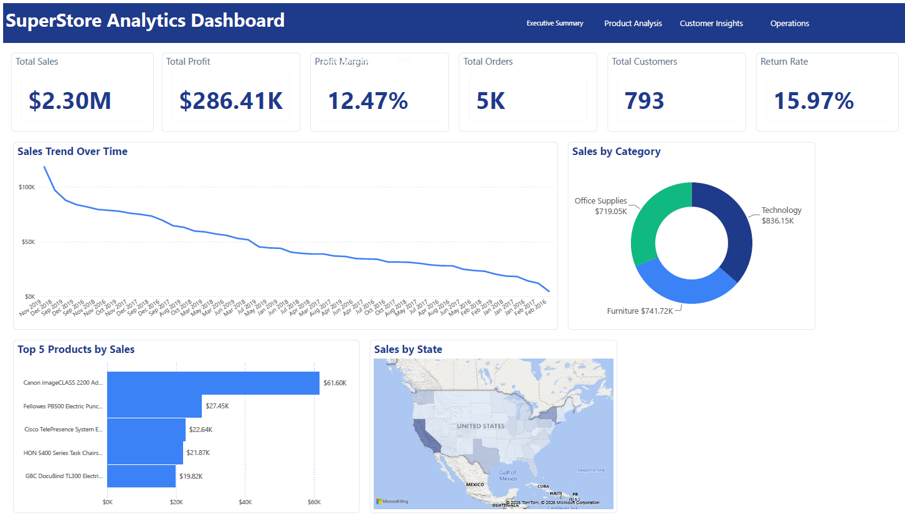
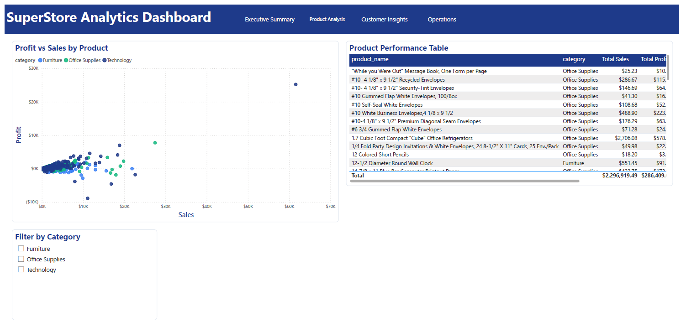
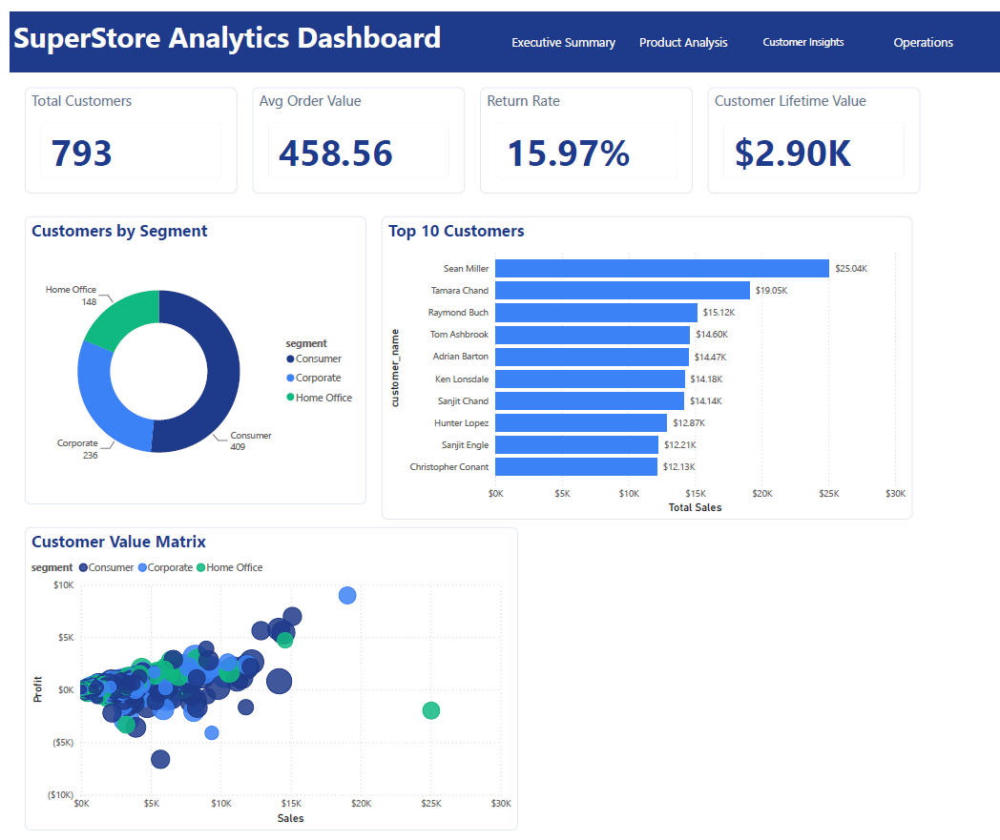
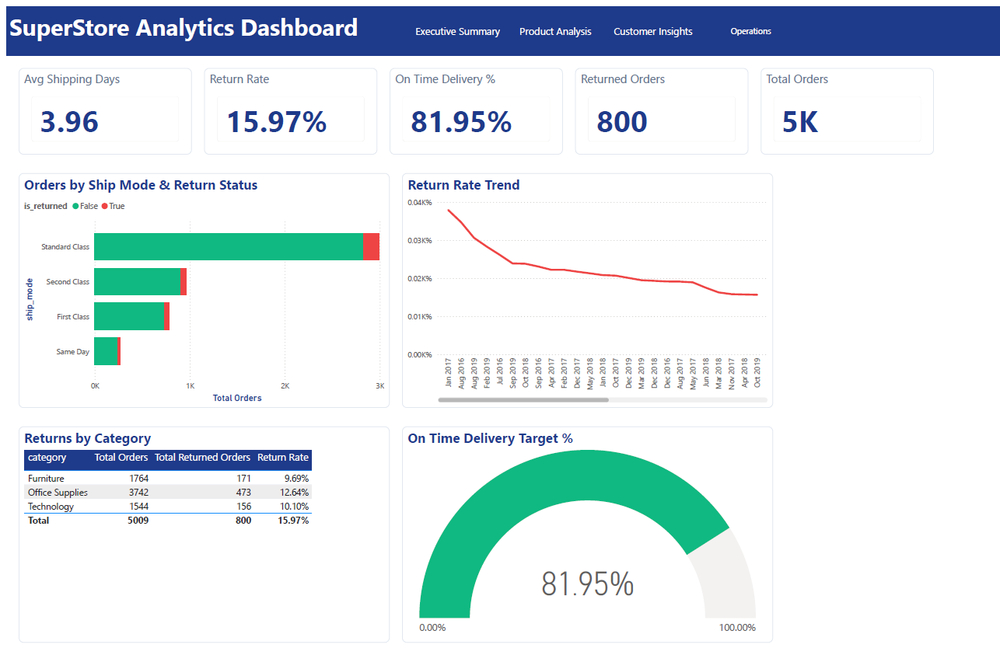

# SuperStore Analytics

An end-to-end data analytics project built on a single retail sales dataset — from raw Excel data, through a SQL Server data warehouse built with a **Medallion (Bronze → Silver → Gold) architecture**, into a **4-page Power BI dashboard**.

This project was built as a hands-on exercise in data warehouse design, T-SQL development, dimensional modeling, and BI dashboard design.

---

## 📖 Overview

Retail sales data (orders, sales reps, and returns) starts as a single Excel workbook and flows through three progressively refined layers in SQL Server before landing in a Power BI report:

```
Excel (raw_data.xlsx)
        │
        ▼
   BRONZE  →  SILVER  →  GOLD  →  Power BI Dashboard
  (raw data) (cleansed) (star schema)
```

- **Bronze** — raw data landed exactly as imported, no transformation
- **Silver** — cleansed, validated, and deduplicated data with documented data-quality fixes
- **Gold** — a star schema (6 dimensions + 1 fact table) built for reporting, plus 6 analytics views
- **Power BI** — a 4-page interactive dashboard with 13 DAX measures, connected directly to the Gold layer

Full technical detail on each stage lives in [`docs/architecture.md`](docs/architecture.md).

---

## 📑 Table of Contents

- [Overview](#-overview)
- [Features](#-features)
- [Technologies Used](#️-technologies-used)
- [Project Structure](#-project-structure)
- [Dashboard Preview](#-dashboard-preview)
- [Installation](#-installation)
- [Database Setup](#️-database-setup)
- [Usage](#-usage)
- [Configuration](#️-configuration)
- [Deployment](#-deployment)
- [Future Improvements](#-future-improvements)
- [Contribution Guidelines](#-contribution-guidelines)
- [License](#-license)
- [About the Author](#-about-the-author)

---

## ✨ Features

- **Medallion architecture** implemented with stored procedures for each layer (`bronze.usp_CreateBronzeTables`, `silver.usp_LoadSilverLayer`, `gold.usp_LoadGoldLayer`)
- **Documented data-quality fixes** — bad dates, invalid ship modes, invalid country codes, missing postal codes, malformed product names, and exact-duplicate removal, all handled in scripted, reproducible SQL rather than manual edits
- **Star schema** with surrogate keys, a role-playing date dimension (order date vs. ship date), and a generated date dimension with fiscal/seasonal attributes
- **6 analytics views** for product, customer, regional, shipping, and monthly-trend reporting
- **Performance indexes** on fact-table foreign keys
- **4-page Power BI dashboard** — Executive Summary, Product Analysis, Customer Insights, and Operations — with 13 custom DAX measures (Total Sales, Profit Margin, CLV, Return Rate, On Time Delivery %, and more)

---

## 🛠️ Technologies Used

| Category | Technology |
|---|---|
| Database | SQL Server (T-SQL, stored procedures, views, indexes) |
| Source data | Microsoft Excel (3-sheet workbook: Orders, People, Returns) |
| Data import | SQL Server Import/Export Wizard (SSMS) |
| BI / Visualization | Power BI Desktop, DAX |
| Architecture pattern | Medallion (Bronze / Silver / Gold), Star Schema (Kimball-style dimensional modeling) |

---

## 📁 Project Structure

```
superstore-analytics/
│
├── README.md                     ← you are here
├── LICENSE
├── .gitignore
│
├── data/
│   └── raw/
│       └── raw_data.xlsx         ← source workbook (Orders, People, Returns sheets)
│
├── sql/
│   ├── 00_init_database.sql      ← creates database + bronze/silver/gold schemas
│   ├── 01_bronze_layer.sql       ← raw landing tables
│   ├── 02_silver_layer.sql       ← cleansing & deduplication
│   ├── 03_gold_layer.sql         ← star schema (dimensions + fact table)
│   ├── 04_views.sql              ← 6 analytics views
│   └── 05_indexes.sql            ← performance indexes
│
├── dashboard/
│   └── superstoredashboard.pbix  ← Power BI report (4 pages)
│
└── docs/
    ├── architecture.md           ← pipeline design & star schema explained
    ├── data_dictionary.md        ← every table/column/view/measure defined
    ├── setup_guide.md            ← step-by-step reproduction guide
    └── screenshots/               ← dashboard page images
```

---

## 🖼️ Dashboard Preview

### Executive Summary


### Product Analysis


### Customer Insights


### Operations


---

## 🚀 Installation

### Prerequisites
- SQL Server (Developer or Express edition), running locally with Windows Authentication
- SQL Server Management Studio (SSMS)
- Power BI Desktop
- Microsoft Access Database Engine Redistributable (required by SSMS to import `.xlsx` files) — [download here](https://www.microsoft.com/en-us/download/details.aspx?id=54920)

### Quick start
```bash
git clone https://github.com/<your-username>/superstore-analytics.git
cd superstore-analytics
```

Then follow the full step-by-step walkthrough in [`docs/setup_guide.md`](docs/setup_guide.md), which covers:
1. Running the SQL scripts in order
2. Importing `data/raw/raw_data.xlsx` into the Bronze layer (via SSMS's Import Wizard — this step is manual since the source is Excel)
3. Loading the Silver and Gold layers
4. Opening the Power BI report and refreshing the connection

---

## 🗄️ Database Setup

The database is rebuilt by running six scripts **in order**:

| Step | Script | What it does |
|---|---|---|
| 1 | `00_init_database.sql` | Creates the `SuperStoreProject` database and `bronze`/`silver`/`gold` schemas |
| 2 | `01_bronze_layer.sql` | Creates raw landing tables |
| — | *(manual)* | Import `data/raw/raw_data.xlsx` into Bronze tables via SSMS Import Wizard |
| 3 | `02_silver_layer.sql` | Cleanses and deduplicates data into the Silver layer |
| 4 | `03_gold_layer.sql` | Builds the Gold star schema (dimensions + fact table) |
| 5 | `04_views.sql` | Creates 6 analytics views |
| 6 | `05_indexes.sql` | Adds performance indexes on the fact table |

⚠️ `00_init_database.sql` drops and recreates the database if it already exists — only run it for a full rebuild.

See [`docs/setup_guide.md`](docs/setup_guide.md) for the complete walkthrough, including the exact Excel import steps and troubleshooting tips.

---

## 📊 Usage

Once the database is built and populated:

- Query the Gold-layer views directly for ad-hoc analysis, e.g.:
  ```sql
  SELECT * FROM gold.vw_monthly_trends ORDER BY year, month;
  ```
- Open `dashboard/superstoredashboard.pbix` in Power BI Desktop to explore the interactive report across its 4 pages: **Executive Summary**, **Product Analysis**, **Customer Insights**, and **Operations**.
- Refresh the Power BI data source if your SQL Server instance name differs from the one the report was originally built against (see `docs/setup_guide.md`, Step 5).

*(See [Dashboard Preview](#️-dashboard-preview) above for screenshots of all 4 pages.)*

---

## ⚙️ Configuration

There's no application config file in this project — the only environment-specific setting is the **SQL Server instance name**, which is referenced in two places:

1. **SSMS Import Wizard** (Step 2 of setup) — set to your local instance when importing the Excel data
2. **Power BI data source** — update via *Home → Transform Data → Data source settings* if it doesn't match your instance

The Gold layer's date range is configurable via parameters on `gold.usp_LoadGoldLayer`:
```sql
EXEC gold.usp_LoadGoldLayer
    @DateRangeStart = '2016-01-01',
    @DateRangeEnd   = '2020-12-31';
```

---

## 📦 Deployment

This project is designed to run on a **local SQL Server instance** for learning/portfolio purposes and isn't currently packaged for cloud deployment. If you want to adapt it:

- **Azure SQL Database** — the T-SQL is largely compatible; you'd need to replace the SSMS Excel Import Wizard step with Azure Data Factory, Power Query, or a `BULK INSERT`/`OPENROWSET` approach, since Azure SQL can't use the local Import Wizard.
- **Power BI Service** — publish the `.pbix` file and set up a scheduled refresh with a gateway if the database moves off your local machine.

These aren't implemented in this repo yet — see **Future Improvements** below.

---

## 🔭 Future Improvements

- [ ] Automate the Excel → Bronze import (e.g., via `BULK INSERT`, SSIS, or a Python/PowerShell script) to remove the manual wizard step
- [ ] Parameterize the SQL Server connection instead of relying on manual Import Wizard/Power BI reconfiguration
- [ ] Add a lightweight CI check (e.g., SQL linting) if the project moves to a shared/team setting
- [ ] Explore Azure SQL + Power BI Service deployment for a fully cloud-hosted version
- [ ] Add row-level data validation tests (e.g., using tSQLt or a simple assertion script) to catch data-quality regressions automatically

---

## 🤝 Contribution Guidelines

This is currently a personal learning project, but suggestions and feedback are welcome:

1. Open an issue describing the suggestion or bug
2. Fork the repo and create a feature branch
3. Submit a pull request with a clear description of the change

---

## 📄 License

This project is licensed under the [MIT License](LICENSE).

*Note: `data/raw/raw_data.xlsx` is a variant of the widely-used "Sample Superstore" dataset, commonly used for BI/analytics learning and demos. It is included here for educational/portfolio purposes.*

---

## 👤 About the Author

**Mohamed Ahmed**

- GitHub: [@diixon](https://github.com/diixon)
- LinkedIn: [mohamed-ahmed-421b9541b](https://www.linkedin.com/in/mohamed-ahmed-421b9541b)
- Email: [mmoohamedahmed1@gmail.com](mailto:mmoohamedahmed1@gmail.com)

This project was built as a hands-on exercise in data warehouse design, SQL Server development, and Power BI dashboarding — feel free to reach out with questions or feedback.
